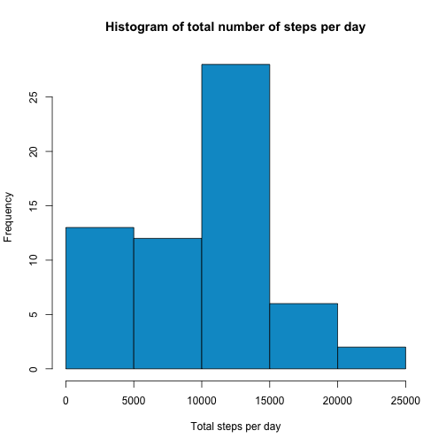
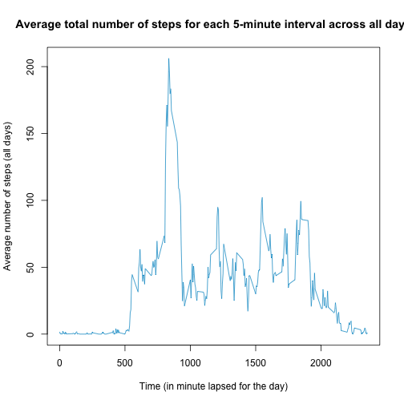
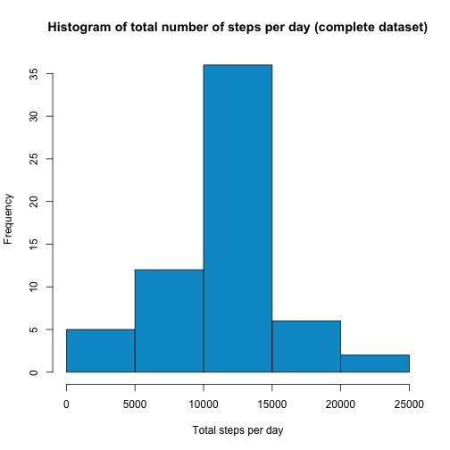
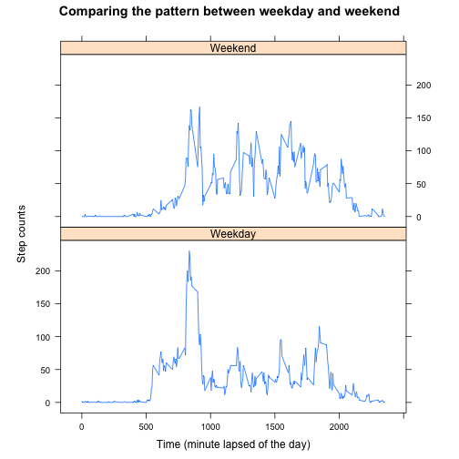

## Loading and preprocessing the data
Load the data into R and parse the date column into ```date``` class.

```r
data <- read.csv("activity.csv", header = TRUE, stringsAsFactors = FALSE)
# use as.Date function to parse the date from string to R Date object.
data$date <- as.Date(data$date, "%Y-%m-%d")
```

We use ```dplyr``` package for data processing and manipulation. The content of first 6 observations of the ```data``` object is as follows:

```r
library(dplyr)
data <- tbl_df(data)
head(data)
```

```
## Source: local data frame [6 x 3]
## 
##   steps       date interval
## 1    NA 2012-10-01        0
## 2    NA 2012-10-01        5
## 3    NA 2012-10-01       10
## 4    NA 2012-10-01       15
## 5    NA 2012-10-01       20
## 6    NA 2012-10-01       25
```

```r
tail(data)
```

```
## Source: local data frame [6 x 3]
## 
##   steps       date interval
## 1    NA 2012-11-30     2330
## 2    NA 2012-11-30     2335
## 3    NA 2012-11-30     2340
## 4    NA 2012-11-30     2345
## 5    NA 2012-11-30     2350
## 6    NA 2012-11-30     2355
```

## What is mean total number of steps taken per day?


```r
# Calculate the sum of the total number of steps of each day by grouping them by day
byDay <- summarize(group_by(data, date), total = sum(steps, na.rm = TRUE))

hist(byDay$total, xlab = "Total steps per day", ylab = "Frequency",
     main = "Histogram of total number of steps per day", col = "deepskyblue3")
```

 

The mean and median total number of steps taken per day are:


```r
data.mean <- mean(byDay$total, na.rm = TRUE)
data.median <- median(byDay$total, na.rm = TRUE)
data.mean
```

```
## [1] 9354.23
```

```r
data.median
```

```
## [1] 10395
```

## What is the average daily activity pattern?


```r
byInterval <- summarize(group_by(data, interval), steps = mean(steps, na.rm = TRUE))
plot(steps ~ interval, data = byInterval, type = "l",
     main = "Average total number of steps for each 5-minute interval across all days",
     ylab = "Average number of steps (all days)", 
     xlab = "Time (in minute lapsed for the day)",
     col = "deepskyblue3")
```

 

The 5-minute interval in which on average across all the days in the dataset contains the maximum number of steps is:

```r
max  <- max(byInterval$steps)
filter(byInterval, steps == max)
```

```
## Source: local data frame [1 x 2]
## 
##   interval    steps
## 1      835 206.1698
```
That is, in the **835th** interval.

## Imputing missing values

To calculate the rows with missing values (```NA```), use the ```is.na()``` function to evaluate the missing values:

```r
missing_rows <- is.na(data$steps)
missing_total <- sum(missing_rows)
missing_total
```

```
## [1] 2304
```
There are **2304** rows with missing values in the dataset.

To generate a more 'complete' dataset, the missing values are calculated using the average of the interval value calculated across all days from the ```byInterval``` dataset calculated above.

```r
# Duplicate the dataset and iterate trough each row. If the 'steps' is missing (NA),
# get the value from byInterval.
data.complete <- data
for (i in 1:nrow(data)) {
    # Proceed to estimate the value from the average
    if (is.na(data[i, ]$steps)) {
        interval <- data[i, ]$interval
        calc.match <- byInterval[byInterval$interval == interval, ]$steps
        data.complete[i, ]$steps = calc.match
    }
}

# data.complete is now a dataset with all missing values filled.
byDay_complete <- summarize(group_by(data.complete, date), total = sum(steps, na.rm = TRUE))

hist(byDay_complete$total, xlab = "Total steps per day", ylab = "Frequency",
     main = "Histogram of total number of steps per day (complete dataset)", col = "deepskyblue3")
```

 

```r
mean(byDay_complete$total, na.rm = TRUE)
```

```
## [1] 10766.19
```

```r
median(byDay_complete$total, na.rm = TRUE)
```

```
## [1] 10766.19
```

As we can observed above, by inputting the missing values using the average of the interval, the histograme shape is more profound "bell-shape" than the original data, and that daily mean and median are higher and closer to each other.

## Are there differences in activity patterns between weekdays and weekends?

The prcessing code using the completed, filled in dataset and use the ```weekdays()``` function to indicate if the day measured is on weekday or weekend.

Then, the average of the total number of steps for each interval across all days is calculated. Finally the plot comparing the pattern on weekend and weekday is shown in the diagram.

```r
# Add a new column to indicate the weekday or weekend
getDay <- function(date) {
    day <- weekdays(date)
    if (day == "Saturday" || day == "Sunday") {
        return("Weekend")
    } else {
        return("Weekday")
    }    
}
day <- sapply(data.complete$date, getDay)
data.complete <- cbind(data.complete, day)

library(lattice)
byInterval.complete <- summarize(group_by(data.complete, interval, day), 
                                 steps = mean(steps, na.rm = TRUE))
xyplot(steps ~ interval | day, 
       data = byInterval.complete, 
       type = "l", aspect = 1/2,
       main = "Comparing the pattern between weekday and weekend",
       ylab = "Step counts", 
       xlab = "Time (minute lapsed of the day)")
```

 
